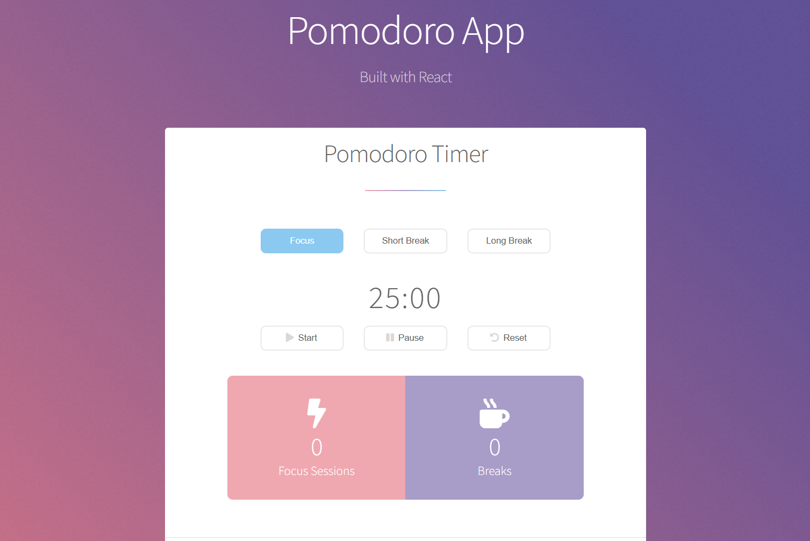
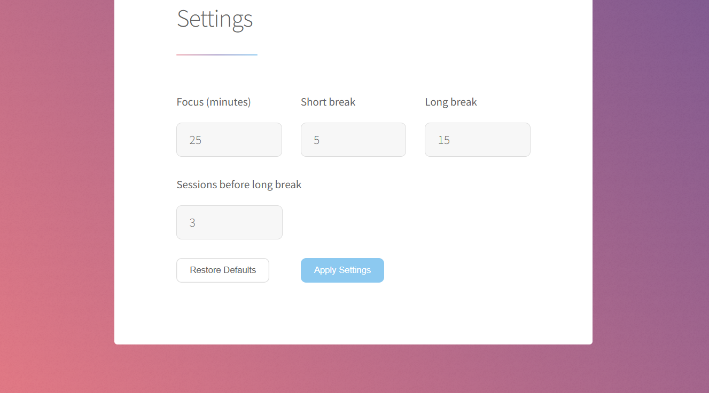

# Customizable Pomodoro App



This app features a Pomodoro timer with focus, short break, and long break modes.

The duration of each mode can be customized by the user via the settings tab.



When the timer ends an alarm will sound and, if the user allows it, a notification will pop up.

### Prerequisites

- Node.js

### Install

```bash
git clone https://github.com/Rhernan12/Pomodoro-App.git
cd Pomodoro-App
npm install
```

### Run (development)

```bash
npm run dev
```

Then open the URL Vite shows.

### Build (production)

```bash
npm run build
npm run preview
```
